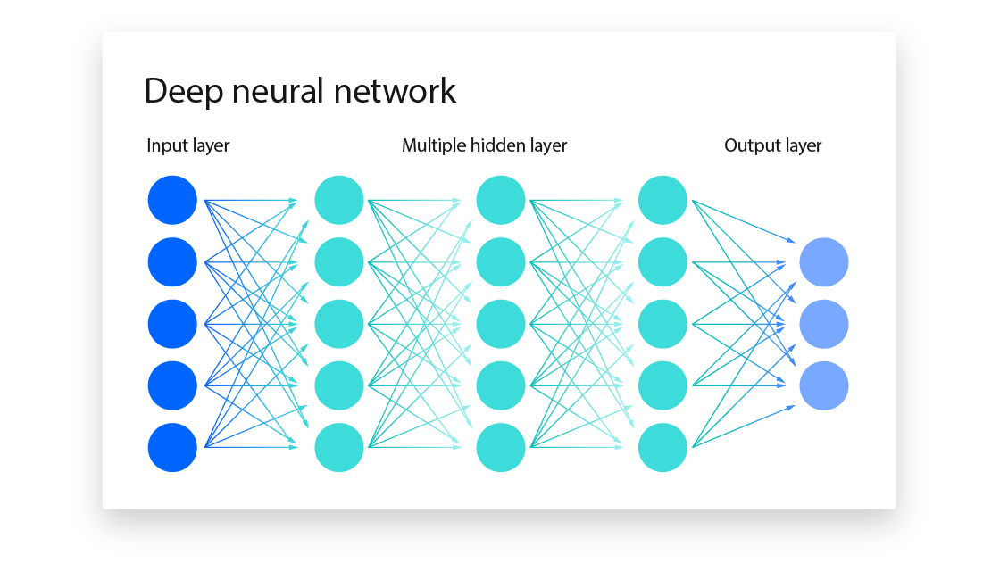

# Machine Learning and Neural Networks Overview

## Supervised vs. Unsupervised Machine Learning

### Supervised Learning:
 - Labeled data (e.g., input-output pairs)
 - Examples: Classification, Regression

### Unsupervised Learning:
 - Unlabeled data
- Examples: Clustering, Dimensionality Reduction

### Neural Networks
#### What is a neural network?
- A neural network is a machine learning (ML) technique that uses artificial intelligence (AI) to teach computers how to process data. Neural networks are inspired by the human brain and are a type of deep learning. 

#### Layers in a neural network
- Layers in a Deep Neural Network
1. Input Layer
Role: Receives the raw data (features) from the outside world.
Structure: Each neuron in the input layer corresponds to a specific feature of the data.
Example:
For image data (28x28 pixels), the input layer will have 
28
×
28
=
784
28×28=784 neurons, one for each pixel.

2. Hidden Layers
Role: Process the input data by applying weights, biases, and activation functions.
Purpose:
Extract features.
Identify complex patterns and relationships in the data.
Characteristics:
The number of hidden layers and neurons in each layer defines the network's capacity.
Each layer's output becomes the input for the next layer.
Transformation: 
𝑧=𝑊⋅+𝑏z=W⋅x+b
𝑎=activation
(
𝑧
)
a=activation(z)
Where:
𝑊
W: Weights matrix
𝑥
x: Input data
ğ‘
b: Bias vector
ğ‘
a: Output after applying the activation function

3. Output Layer
Role: Produces the final result of the network.
Structure:
The number of neurons corresponds to the number of classes or outputs.
Example:
For binary classification: 1 neuron with sigmoid activation.
For multi-class classification: 
𝑛
n-neurons with softmax activation.